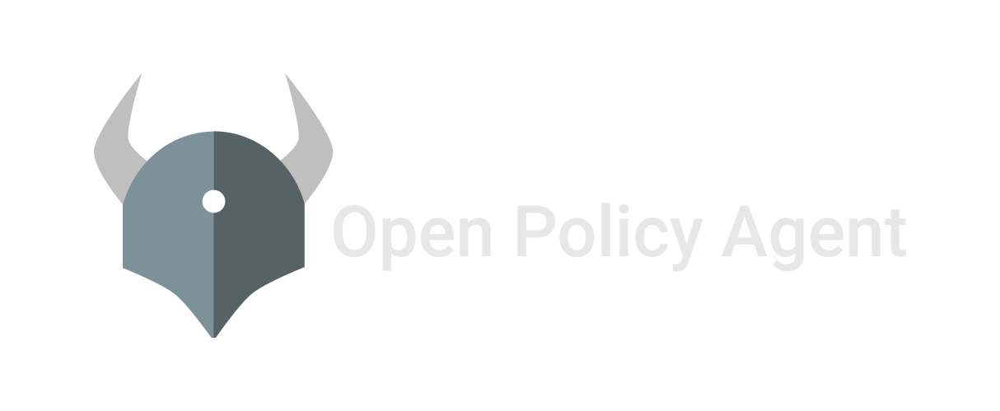
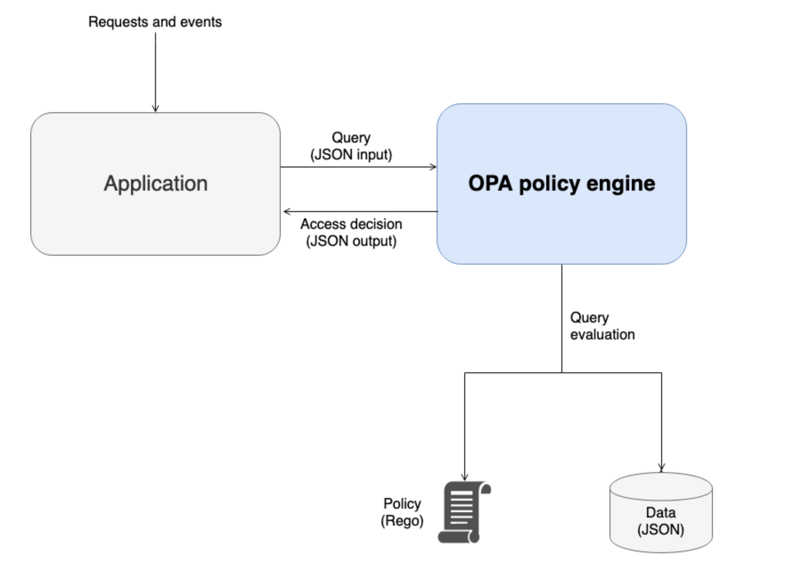
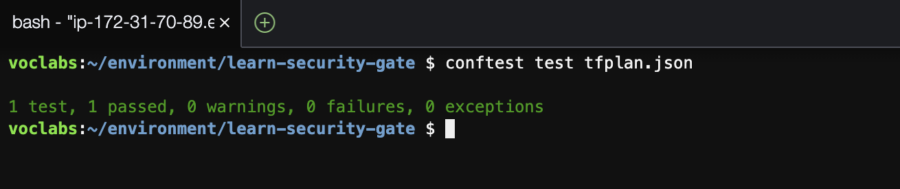

# learn-security-gate
Laboratório simples com um teste de implantação usando terraform e aplicação de um controle simples com a linguagem rego



## PARTE 1: Testes usando o terraform e o conceito de iac:

Para execução deste laboratório crie uma cópia local deste repositório:

```sh
git clone https://github.com/fiapdevops/learn-security-gate.git
```

1.2. Instalação das dependências:

```sh
sudo yum install -y yum-utils shadow-utils && \
sudo yum-config-manager --add-repo https://rpm.releases.hashicorp.com/AmazonLinux/hashicorp.repo && \
sudo yum -y install terraform
```

**Sobre o Terraform**

O Terraform é uma ferramenta de infraestrutura como código (IaC) que permite automatizar a implantação e o gerenciamento de infraestrutura em diversos provedores de nuvem (neste caso utilizaremos a ferramenta em ambiente AWS), a provocação aqui será validar uma estrutura simples para criar grupos de segurança na AWS e em seguida implementar um controle sobre o perfil destes grupos.

1.3. Inicie o terraform:

```sh
cd learn-security-gate/

terraform init
terraform plan
```

> Verifique a partir do comando anterior no terminal o recurso que seria criado e as regras de acesso (neste caso liberações para as portas 80 e 443 na internet), considerando o contexto em que estariamos autorizando uma aplicação para acesso externo.

1.4. Antes de prosseguir acesso o console da AWS, verifique quais os grupos de segurança atuais a partir do menu **Services**, **Compute** / **EC2**, na tela a seguir escolha a opção **Security Groups** e note que o grupo **web_sg** ainda não foi criado, após o teste execute o código no terraform a partir da sua ide:

```sh
terraform apply
```

1.5. Aguarde a correta execução e valide o processo repetindo a consulta no painel da AWS, este é um exemplo simples de linguagem declarativa para descrever a infraestrutura desejada em formato de código, **infrascruture as a code**.

> O mesmo conceito poderia ser usado para criar outros objetos como regras de IAM, usuários locais, configuração de buckets e etc.

---

## PARTE 2: Testes usando um princípio de validação de políticas sobre o código

Nesta etapa utilizaremos uma solução simples para criar um mecanismo de controle, o objetivo é simular o processo de validação sobre as regras criadas na PARTE 1, o mecanismo que será usado neste teste é o [conftest](https://www.conftest.dev/) uma solução de linha de comando para testes sobre dados estruturados.

O conftest fará a validação usando a linguagem declarativa [rego](https://www.openpolicyagent.org/docs/latest/policy-language/) do solução [Open Policy Agent](https://www.openpolicyagent.org/) conforme o fluxo abaixo:



2.1. Faça a instalação do conftest, copiando a sequência de comandos abaixo:

```sh
LATEST_VERSION=$(wget -O - "https://api.github.com/repos/open-policy-agent/conftest/releases/latest" | grep '"tag_name":' | sed -E 's/.*"([^"]+)".*/\1/' | cut -c 2-)
ARCH=$(arch)
SYSTEM=$(uname)
wget "https://github.com/open-policy-agent/conftest/releases/download/v${LATEST_VERSION}/conftest_${LATEST_VERSION}_${SYSTEM}_${ARCH}.tar.gz"
tar xzf conftest_${LATEST_VERSION}_${SYSTEM}_${ARCH}.tar.gz
sudo mv conftest /usr/local/bin
```

2.2. Com o conftest instalado crie um diretório onde serão desenvolvidas as regras de validação:

```sh
mkdir policy
```

2.3. Usando o editor de sua preferência escreva a regra de testes:

```sh
cat <<EOF > policy/validar_sg.rego

package main

deny_fully_open_ingress[msg] {

    resource := input.resource_changes[_]
    name := resource.name
    rule := resource.change.after.ingress[_]
    resource.type == "aws_security_group"
    rule.from_port != 80
    rule.from_port != 443
    contains(rule.cidr_blocks[_], "0.0.0.0/0")
    
    msg = sprintf("O ASG `%v` cria uma liberação full de acesso a internet em portas não mapeadas", [name])
}
EOF
```

Essa regra executará nossa primeira validação, será aceito apenas grupos de segurança com liberação de acesso a internet usando as portas 80 e 443.

### Usando o conftest

O conftest é uma solução de validação e atua como um gateway keeper, ele recebe uma estrutura declativa como entrada, executa uma validação de acordo com as regras estruturadas e fornece uma saída que poderá ser consumida em um pipeline ou ferramenta de segurança, para testar a regra acima execute as seguintes etapas:

2.4. Crie uma nova saída em formato binário para o conteúdo do terraform que usamos para criar nosso grupo de segurança:

```sh
terraform plan --out tfplan.binary
```

2.5.  Use o comando terraform show para converter o plano Terraform em JSON para que o conftest possa consumir o conteúdo:

```sh
terraform show -json tfplan.binary > tfplan.json
```

2.6. Verifique que temso a mesma estrutura declarativa usada para o terraform criar nossa infraestrutura:

```sh
cat tfplan.json | jq
```

2.7. Utilize o conftest para validar a estrutura de acordo com a regra que criamos:

```sh
conftest test tfplan.json
```

Você deverá receber a seguinte mensagem:




> Isso signifca que a estrutura fornecida em json não viola a regra estabelecida no arquivo validar_sg.rego criado na pasta policy.

### Criando uma violação como contra-prova

3.1. Abra o arquivo main.tf e faça um ajuste, adicionaremos uma nova regra liberar a porta 8080 para a Internet, copie o código abaixo e cole no final do arquivo **antes do fechar a última chave "}":

```sh
provider "aws" {
  region = "us-east-1"  # Região desejada
}

resource "aws_security_group" "web_sg" {
  name        = "web_sg"
  description = "Security group for web servers"

  ingress {
    from_port   = 80
    to_port     = 80
    protocol    = "tcp"
    cidr_blocks = ["0.0.0.0/0"]  # Liberar acesso à internet para a porta 80
  }

  ingress {
    from_port   = 443
    to_port     = 443
    protocol    = "tcp"
    cidr_blocks = ["0.0.0.0/0"]  # Liberar acesso à internet para a porta 443
  }

  egress {
    from_port   = 0
    to_port     = 0
    protocol    = "-1"
    cidr_blocks = ["0.0.0.0/0"]  # Permitir tráfego de saída para qualquer destino
  }

  ingress {
    from_port   = 8080
    to_port     = 8080
    protocol    = "tcp"
    cidr_blocks = ["0.0.0.0/0"]  # Liberar acesso à internet para a porta 8080
  }
}
```

3.2. Para validar que existe uma mudança a ser aplicada utilize o comando terraform plan:

```sh
terraform plan
```

3.3. Repita a execução das etapas 2.4. e 2.5. (criaremos uma nova amostra em json da estrutura que será aplicada):

```sh
terraform plan --out tfplan.binary
terraform show -json tfplan.binary > tfplan.json
```

3.4. Repita o teste de configuração:

```sh
conftest test tfplan.json
```

Você receberá a seguinte mensagem:


---

## PARTE3: Complicando o teste:

Considere o bloco a seguir com uma segunda regra que poderia seria adicionada ao final do aruqivo validar_sg.rego:

```sh
deny_port_22_ingress[msg] {
    resource := input.resource_changes[_]
    name := resource.name
    rule := resource.change.after.ingress[_]
    resource.type == "aws_security_group"
    rule.from_port == 22
    rule.to_port == 22
    not_equal_cidr(rule.cidr_blocks[_], "192.168.0.0/24")
    not_equal_cidr(rule.cidr_blocks[_], "172.12.0.0/16")

    
    msg = sprintf("O ASG `%v` permite acesso à porta 22 fora do padrão de segurança previsto para o ambiente", [name])
}

not_equal_cidr(cidr, target) {
    cidr_split := split(cidr, "/")
    target_split := split(target, "/")
    cidr_prefix := cidr_split[0]
    target_prefix := target_split[0]
    cidr_prefix != target_prefix
}
```

Sobre quais situações essa regra seria envalidada repetindo os testes anteriores com conftest?

**Outras referências**

Para um exemplo baseado em outro contexto considere este artigo da AWS com outros modelos mais complexos de validação de fluxo: [https://docs.aws.amazon.com/prescriptive-guidance/latest/saas-multitenant-api-access-authorization/opa.html](https://docs.aws.amazon.com/prescriptive-guidance/latest/saas-multitenant-api-access-authorization/opa.html);

Neste outro exemplo publicado por Miguel A Menendez a mesma lógica é aplicada a outro contexto, a validação sobre uma whitelist de imagens para containers: [https://menendezjaume.com/post/policy-as-code-exceptions-lists/](https://menendezjaume.com/post/policy-as-code-exceptions-lists/);

---

##### Fiap - MBA
profhelder.pereira@fiap.com.br

**Lets Rock the Future**
